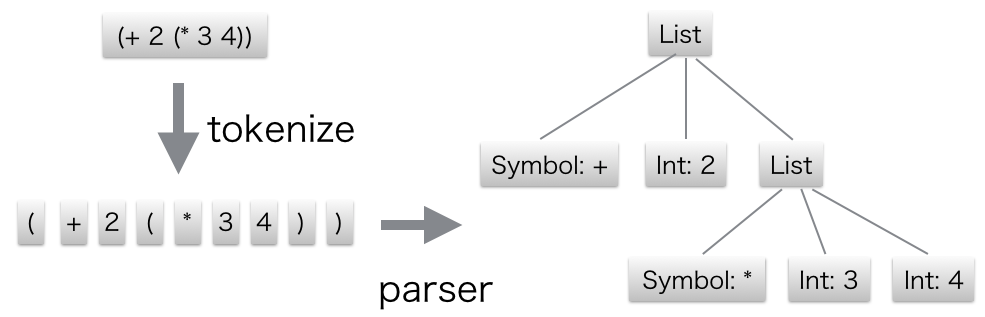
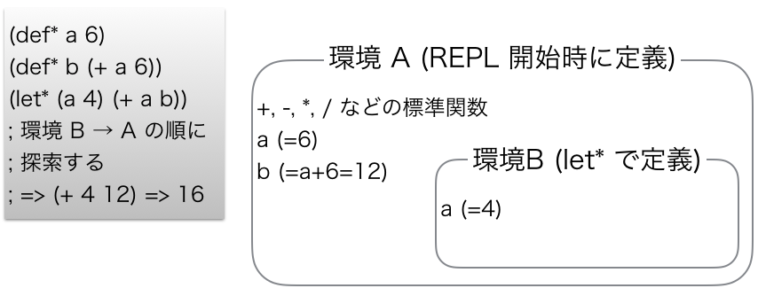

Make a Lisp with Crystal!
=========================

## はじめに

この章では Crystal を使って Lisp 処理系 (インタープリタ) を実装していきます。Crystal の入門を終えた次のステップを想定しています。

### なぜ Lisp なのか？

Lisp はとても長い歴史を持ち、非常に強力ながらとてもシンプルな言語です。単純明快な構文を持っています。括弧で式を括るS式と呼ばれる構文はとてもパースしやすく初心者にも簡単に実装できます (今回はさらにサボった実装にします) 。以上から、初心者が最初に実装する処理系として選ばれることが多く、今回も Lisp を選択しました。ここでは Ruby を多少触ったことがあること、Lisp の構文の基本を理解していることを前提に解説を進めます (Lisp の解説サイトをぐぐってざっと眺める程度で大丈夫です) 。

### Make a Lisp

Lisp には多くの方言がありますが、本章では [Make a Lisp (mal)](https://github.com/kanaka/mal) の Lisp を実装していきます。mal は色々な言語で Lisp を実装するというプロジェクトで、[ガイド](https://github.com/kanaka/mal/blob/master/process/guide.md) に従ってステップ・バイ・ステップで Lisp のインタープリタを実装していくことができます。ステップは全部で10あり、末尾再帰最適化やセルフホスト (Crystal で実装した mal で実装した mal) まで実装することができます。

私はこの Make a Lisp プロジェクトをとても推しています。理由は2つあります。

1. 分からない時は他の知っている言語による実装を読むことでヒントを得られる。
2. 一度実装すればどのような仕様か分かるので、他の知らない言語による実装を読むことで他の言語について知ることができる。

特に 2. はとても楽しめます。Lisp 処理系は入門書などにある非常に簡単な例でなくある程度複雑なソフトウェアですので、多少泥臭い実装が入ってくるなど様々な言語の「現実的な」実装を読むことができます。

なお、筆者は Make a Lisp プロジェクトに Crystal の実装のプルリクエストを送り取り込まれました。本章もそれに沿って解説しています。紙面の都合上、コード全体を載せることはできませんので、コード全体を見渡したいときはそちらをご覧ください。 (一部実装を端折ったところがあるため完全には一致しませんが、本誌のコード片と合わせて御覧ください。) また、全てを解説するには量が多すぎますので、いくつかのトピックを省いています。

https://github.com/kanaka/mal/tree/master/crystal

また、私が実際に送ったプルリクエストは下記です。大体ステップごとになっています。各ステップごとの実装をご覧になりたい場合は、こちらのプルリクエストの各コミットを御覧ください。

https://github.com/kanaka/mal/pull/70

## Step0: REPL 準備

まずは mal のリポジトリを clone し、自分用の作業ディレクトリをつくりましょう。

```
$ git clone https://github.com/kanaka/mal.git && cd mal
$ mkdir my-lisp && cd mkdir
```

mal には各ステップごとのテストケースが含まれていますので、自分の実装が正しいかどうかチェックすることができます。

まずはディレクトリ直下にある Makefile を編集して、テストを簡単に実行できるようにしましょう。

```makefile
# my-lisp を追加
IMPLS = ... mal my-lisp ocaml ...

...

mal_STEP_TO_PROG	=	mal/$($(1)).mal
# my-lisp ディレクトリを登録
mylisp_STEP_TO_PROG	=	my-lisp/$($(1))
```

これだけで `make "test^my-lisp^stepX"` とすると `my-lisp/stepX_xxx` というバイナリを対象に step X のテストが実行されます (X は 0～10 の各ステップです)

試しに `my-lisp/step0_repl.cr` というファイルをつくりましょう。

```crystal
puts "Hello, world"
```

`crystal` コマンドでビルドし、試しに実行して "Hello, world" が表示されることを確認してからテストを実行し、テストが fail することを確認してみましょう。

```
$ crystal step0_repl.cr
$ ./step0_repl
$ make 'test^my-lisp^step0'
```

このステップでは REPL の外枠だけを作ります。

REPL とは **R**ead **E**val **P**rint **L**oop の略で、インタラクティブにプログラムを入力し、結果を出力できるプログラムです。Ruby では標準で irb という REPL が提供されています。

```crystal
def read(x)
  x # TODO
end

def eval(x)
  x # TODO
end

def print(x)
  x # TODO
end

def rep(x)
  read(eval(print(x)))
end

loop do
  print "user> "
  puts rep(gets.chomp)
end
```

今は入力したものがそのまま表示されるだけです。
次のステップでは上記の TODO 部分の実装を埋めていきます。


## Step1: Read と Print

### 文字列をパースする

step 1 では REPL の外枠部分として読み込みと表示部分をつくります。

ファイル名を `step1_read_print.cr` に変えて、文字列で入力されたプログラムをプログラムが処理しやすい木構造に変換するパーサを実装するためのファイル `reader.cr` をつくります。

`reader.cr` は 入力された Lisp の式をトークンごとにバラバラにし (tokenize) 、トークンを読んで AST  (抽象構文木) に変換 (parse) します。AST とはそのプログラムの構造を木構造で表したものです。木構造にすることで、プログラムから扱うのが容易になります。



最初に `tokenize` を実装します。ここでは `"(+ 10 22)"` を `["(", "+", "10", "22", ")"]` というふうに不要な空白や改行を削除しトークンに分けます。

```crystal
def tokenize(str)
  regex = /[\s,]*(~@|[\[\]{}()'`~^@]|"(?:\\.|[^\\"])*"|;.*|[^\s\[\]{}('"`,;)]*)/
  str.scan(regex).map{|m| m[1]}.reject(&.empty?)
end
```

なんとこれだけです。Lisp は括弧を多用する構文のため、正規表現で分割し空文字列を除去するだけで簡単にトークンに切り分けることができます。正規表現の各部分について説明します。

* `[\s,]*`: 空白とコンマにマッチして読み飛ばします
* `~@`: unquote に使う単項演算子を切り出します
* ```[\[\]{}()'`~^@]```: mal で有効な ```[]{}'`~^@``` のうちの1文字の記号を切り出します。
* `"(?:\\.|[^\\"])*"`: `"aa\"a"` のような文字列リテラルを切り出します。
* `;.*`: コメント部分を切り出します。mal では `;` の後行末までがコメントになります。
* ```[^\s\[\]{}('"`,;)]*```: 変数名などのシンボル、`true` や `false`、`nil` といった定数を切り出します。

Ruby とほぼ同様に文字列を正規表現で scan し、キャプチャした文字列を取り出します。コメントなどの読み飛ばされるトークンがある場合は上記の `m[1]` (1つ目の部分マッチ) が空になるため、後の `reject` でそれを削除します。
これで文字列から切り出したトークン列を得ることができました。`tokenize "(print (+ (- 10 1) 5))"` のように試しに実行してみて正しくトークンを切り出せているか確認してみましょう。

実際は、一般的にはプログラミング言語のトークンの切り出しは正規表現ではなく専用の tokenizer を実装します。例えば [mal の OCaml 実装](https://github.com/kanaka/mal/blob/master/ocaml) は真面目にその処理をやっていますし、[Crystal の tokenizer も非常に素朴に実装されています](https://github.com/crystal-lang/crystal/blob/master/src/compiler/crystal/syntax/lexer.cr) ので、気になる方はそちらを参照してください。

次に、AST のノードを定義します。木構造をつくるため、ノードの型は再帰的な型になります。mal は全てが式なため、AST は式を表すものになり、式は値を持ち、値は型を持ちます。そのため、mal では AST のノードに Type という型名をつけています。さっそく `types.cr` を作成し、`module Mal` の中に `Type` class を実装していきましょう。

```crystal
module Mal
  class Symbol
    property :str
    def initialize(@str : String)
    end

    def ==(other : Symbol)
      @str == other.str
    end
  end

  class List < Array(Type)
  end

  class Vector < Array(Type)
  end

  class HashMap < Hash(String, Type)
  end

  class Atom
    property :val
    def initialize(@val : Type)
    end

    def ==(rhs : Atom)
      @val == rhs.val
    end
  end

  class Type
    alias Func = (Array(Type) -> Type)
    alias ValueType = Nil | Bool | Int32 | String | Symbol | List | Vector | HashMap | Func | Atom

    def initialize(@val : ValueType)
    end

    def initialize(other : Type)
      @val = other.unwrap
    end

    def unwrap
      @val
    end

    def to_s
      pr_str(self)
    end

    def ==(other : Type)
      @val == other.unwrap
    end
  end

  alias Func = Type::Func
end
```

まずは mal の式がどういった型を取るかについて説明します。

- `Symbol` : シンボルという文字列のようで文字列ではない型です。名前のようなもので、例えば `(+ 1 2)` の `+` や `(print a)` の `print` および `a` などがそうです。
- `List` : 任意個数の値を保持するリストです。Crystal では `Array` class を使って実装します。
- `Vector` : List と同様に任意個数の値を保持する配列です。List は単方向リスト、Vector は配列で実装されることが多いようですが、Crystal では両方とも `Array` を使って実装します。
- `HashMap` は文字列をキーとして任意の値を保持する連想配列です。Crystal では `Hash` class を使って実装します。
- `Atom` は最小の要素を表す値で、論理値 `true`/`false`、数値、文字列、シンボル、`nil` のいずれかの値を持ちます。
- `Func` は関数を表す値です。任意個の引数を取り、値を1つ返します。
- `Type` は上記のいずれかのうち1つの値を保持している Union 型です。Ruby の変数がどの型の値を持つか動的に変わるように、どの型の値かは動的に決まります。

上記の型を順に実装しています。Crystal では型の前方参照が可能なため、`Type` を定義する前に `Type` という型を使った `List` 型を実装するといったことが可能です。AST のノードを表す `Type` 型は内部の `ValueType` にノードが取りうる型の Union 型を持ち、各型の値を保持することができます。例えば `42` という数値を保持している時は `Type` の `@val` インスタンス変数は `Int32` 型になり `42` という値を持ちます。

ちなみに、Crystal では外からインスタンス変数にアクセスするためには `property` マクロを使って外からアクセスしても良いインスタンス変数名を指定します。これで各ノードが持つ値にアクセスできます。

これだけでは実装は足りません。値は比較できなければならないため、`<`、`>`、`<=`、`>=` といった比較演算子が必要です。`Type` 型の値を比較するには wrap している `@val` を比較する必要があり、そのためには `@val` の値を取り出して比較する必要があります。

```crystal
class Type
  ...

  # < 演算子の実装
  def <(other : Mal::Type)
    l, r = @val, other.unwrap
    if l.is_a?(String) && r.is_a?(String)
      return l < r
    end
    if l.is_a?(Int32) && r.is_a?(Int32)
      return l < r
    end
    if l.is_a?(Symbol) && r.is_a?(Symbol)
      return l.str < r.str
    end
    false
  end

  ...
end
```

このような演算子を4つ定義する必要があります。このようなボイラープレートをまとめるための機能として Crystal はマクロを提供しています。下記のようなマクロを組み、`:<`, `:>`, `:<=`, `:>=` を与えてやることで4つの演算子それぞれに (演算子部分だけ異なった) 似たような実装をすることができます。

```crystal
class Type
  ...

  macro rel_op(*ops)
    
      def {{op.id}}(other : Mal::Type)
        l, r = @val, other.unwrap
          
            if l.is_a?({{t}}) && r.is_a?({{t}})
              return (l) {{op.id}} (r)
            end
          
          if l.is_a?(Symbol) && r.is_a?(Symbol)
            return l.str {{op.id}} r.str
          end
        false
      end
    
  end

  rel_op :<, :>, :<=, :>=

  ...
end
```

Crystal ではマクロにはまったく別の構文を使い、制御構文は `` で囲み、トークンの埋め込みは `{{ }}` で囲みます。例えば `(l) {{:>.id}} (r)` は `(l) > (r)` に展開されます。mal の値では Int, String, Symbol のみが直接比較できるため、この3つについては比較する処理を書き、それ以外は `false` を返すようにします。ここでは引数に演算子をすべて取り、それをマクロの `for` 構文でループしながら各演算子のメソッドを定義しています。

次に読み取ったトークン列から AST を構成する `Reader` をつくります。これはトークンの配列を頭から順に読んでいき、それを木構造に置き換えていく処理です。ここでは REPL の読みに従って Reader という名前が選ばれていますが、一般的にはパーサと呼ばれているものです。

```crystal
class Reader
  def initialize(@tokens : Array(String))
    @pos = 0
  end

  # ここにパースするためのメソッドを実装する
end
```

`Reader` はプログラムのトークン列 `@tokens` と現在指しているのトークン位置 `@pos` の2つの内部状態を持っています。まずは現在のトークンを返す `peek` と現在のトークンを返しつつトークン位置を前に進める `next` メソッドをつくります。`peek` 内ではコメントを読み飛ばします。

```crystal
def current_token
  @tokens[@pos] rescue nil
end

def peek
  t = current_token

  if t && t[0] == ';'
    @pos += 1
    peek
  else
    t
  end
end

def next
  peek
ensure
  @pos += 1
end
```

Atom をパースするためのメソッド `read_atom` をつくります。先ほど紹介したように論理値、数値、文字列、シンボル、`nil` のいずれかの値を取ります。

```crystal
def read_atom
  token = self.next
  throw "expected Atom but got EOF" unless token

  Mal::Type.new case
    when token =~ /^-?\d+$/ then token.to_i
    when token == "true"    then true
    when token == "false"   then false
    when token == "nil"     then nil
    when token[0] == '"'    then token[1..-2].gsub(/\\"/, "\"")
                                             .gsub(/\\n/, "\n")
                                             .gsub(/\\\\/, "\\")
    else Mal::Symbol.new token
    end
end
```

先頭の1トークンを取ってきてそのトークンの中身を調べ、適切な値をセットしています。

次にリストとベクターをパースします。リストとベクターはそれぞれ `(` と `[` で始まり、式を `)` と `]` が来るまで要素の式を繰り返し読み、それぞれのクラス `List` と `Vector` を生成します。リストとベクターは `(, )` と `[, ]` が違うだけですので、ヘルパーメソッド `read_sequence` を作成してそれを利用します。

```crystal
def read_sequence(init, open, close)
  token = self.next
  raise "expected '#{open}', got EOF" unless token
  raise "expected '#{open}', got #{token}" unless  token[0] == open

  loop do
    token = peek
    raise "expected '#{close}', got EOF" unless token
    break if token[0] == close

    # 要素を1つ読み込んでリストに追加
    init << read_form
    peek
  end

  self.next
  init
end

def read_list
  Mal::Type.new read_sequence(Mal::List.new, '(', ')')
end

def read_vector
  Mal::Type.new read_sequence(Mal::Vector.new, '[', ']')
end
```

`read_form` は式を1つパースするメソッドで、後で定義します。

ハッシュマップをパースします。mal のハッシュマップは `{key0 val0 key1 val1 ...}` というふうに定義できるため、key になる式と value になる式を交互にパースし、key-value の組として `HashMap` class の要素として登録していきます。ここで key の読み込みの部分で書いたように、Crystal では case-when 式で型 guard を書くことができます。下の実装では、`ValueType` 型の値 `k` が `String` の時に `when String` 節に入り、節の中では `k` の型は `String` になります。

```crystal
def read_hashmap
  types = read_sequence([] of Mal::Type, '{', '}')

  raise "odd number of elements for hash-map: #{types.size}" if types.size.odd?
  map = Mal::HashMap.new

  types.each_slice(2) do |kv|
    k, v = kv[0].unwrap, kv[1]
    case k
    when String
      map[k] = v
    else
      raise "key of hash-map must be string or keyword"
    end
  end

  Mal::Type.new map
end
```

最後に式をパースする `read_form` を定義します。`read_form` は現在のトークンを見てどの構文をパースすべきかを判断し、今まで定義してきた `read_list`, `read_vector`, `read_hashmap`, `read_atom` を呼び分けます。呼ばれた `read_list` 内などでさらに `read_form` が呼ばれることで、リストの中の要素の式などの入れ子構造が再帰的にパースされます。

```crystal
def list_of(symname)
  Mal::List.new << gen_type(Mal::Symbol, symname) << read_form
end

def read_form
  token = peek

  raise "unexpected EOF" unless token
  raise "unexpected comment" if token[0] == ';'

  Mal::Type.new case token
  when "("  then read_list
  when ")"  then raise "unexpected ')'"
  when "["  then read_vector
  when "]"  then raise "unexpected ']'"
  when "{"  then read_hashmap
  when "}"  then raise "unexpected '}'"
  when "'"  then self.next; list_of("quote")
  when "`"  then self.next; list_of("quasiquote")
  when "~"  then self.next; list_of("unquote")
  when "~@" then self.next; list_of("splice-unquote")
  when "@"  then self.next; list_of("deref")
  else           read_atom
  end
end
```

また、`'` などの単項演算子もここで処理しておきます。例えば `'expr` は `(quote expr)` としてパースされます。quote や quasiquote は今後出てくる構文のため、今は仕様に従ってとりあえずパース部分のみ実装しておきます。

最後に、トークンを切り出してパースする処理を一気に行う `read_str` を定義します。

```crystal
def read_str(str)
  r = Reader.new(tokenize(str))
  begin
    r.read_form
  ensure
    raise "expected EOF, got #{r.peek.to_s}" unless r.peek.nil?
  end
end
```

### 式を文字列化し表示する

`printer.cr` を作成し、今度は逆に AST から文字列に変換する関数を作ります。これは REPL の P の部分に主に使われます。

mal の値を受け取り `String` を返す関数 `pr_str` を定義します。

```crystal
def pr_str(value, print_readably = true)
  case value
  when Nil          then "nil"
  when Bool         then value.to_s
  when Int32        then value.to_s
  when Mal::List    then "(#{value.map{|v| pr_str(v, print_readably) as String}.join(" ")})"
  when Mal::Vector  then "[#{value.map{|v| pr_str(v, print_readably) as String}.join(" ")}]"
  when Mal::Symbol  then value.str.to_s
  when Mal::Func    then "<function>"
  when Mal::HashMap
    # step1_read_print.cr requires specifying type
    "{#{value.map{|k, v| "#{pr_str(k, print_readably)} #{pr_str(v, print_readably)}" as String}.join(" ")}}"
  when String
    case
    when value.empty?()
      print_readably ? value.inspect : value
    when value[0] == '\u029e'
      ":#{value[1..-1]}"
    else
      print_readably ? value.inspect : value
    end
  when Mal::Atom
    "(atom #{pr_str(value.val, print_readably)})"
  else
    raise "invalid MalType: #{value.to_s}"
  end
end

def pr_str(t : Mal::Type, print_readably = true)
  pr_str(t.unwrap, print_readably) + (t.macro? ? " (macro)" : "")
end
```

オーバーロードを利用し、生の値を受け取った場合はそのまま文字列化し、`Mal::Type` で包まれた値を受け取ったときは中身の `@val` を取り出してから `pr_str` に投げ直します。Crystal では `A | B | C` のような Union 型の値に対して各型に分岐したいときは `case v; when A then expr; when B then ...` のように case 文を用いて書くことができます。

引数 `print_readably` は文字列型の値を文字列化するときに引用符 `"` を左右に付けるかどうかを制御するフラグです。

以上で読み込みおよび書き出しの処理が完了しました。あとは各ファイルを `step1_read_print.cr` から `require` し、作成した `read_str` 関数および `pr_str` 関数を `read` および `print` 関数から呼び出せば完成です。下記のようにして意図通りに動いているかを確認しましょう。

```
$ make 'my-lisp^test^step1'
```


## Step2: Eval

ここでは Step1 でパースした AST を受け取り、それを評価して結果を表示する処理を作成します。`step1_read_print.cr` を `step2_eval.cr` に書き換えましょう。

まだ変数を導入していないため、REPL は状態を持てず、入力された式の結果を表示するだけです。状態を持つには環境が必要で、環境は Step3 で導入します。そうはいっても関数のテーブル (例えば `+` などの関数はデフォルトで定義された関数型の定数になります) についてはどこかに定義しておかなければならないため、一時的に下記のようにテーブルをグローバルに定義しておきます。

```crystal
def num_func(func)
  -> (args : Array(Mal::Type)) {
    x, y = args[0].unwrap, args[1].unwrap
    raise "invalid arguments" unless x.is_a?(Int32) && y.is_a?(Int32)
    Mal::Type.new func.call(x, y)
  }
end

$repl_env = {
  "+" => num_func(->(x : Int32, y : Int32){ x + y }),
  "-" => num_func(->(x : Int32, y : Int32){ x - y }),
  "*" => num_func(->(x : Int32, y : Int32){ x * y }),
  "/" => num_func(->(x : Int32, y : Int32){ x / y }),
} of String => Mal::Func
```

`num_func` は数値用の演算子を定義するためのヘルパーです。Crystal の世界で2つの整数を受け取って整数を返す関数を、mal の世界での2つの整数を受け取って整数を返す関数に変換します。
mal の世界では引数は `Type` 型で wrap された値のリストまたはベクターで受け取り、`Type` 型で wrap された値を返しますので、一旦 `Type` 型の値を受け取ってそれが整数型の値であることを確認し、結果を計算した後に `Type` 型の値に包んで返します。

なお、Crystal では `if` や `unless` による型 guard もあり、それを利用しています。

```crystal
# T か U か V の型の値を受け取る関数
def foo(arg : T | U | V)
  raise "This is not value of T" unless arg.is_a? T
  # ここでは arg の型は T と確定する
  some_func arg
end
```

これで `+`, `-`, `*`, `/` を保持する仮の関数テーブルを `Hash` 型の値で作成しました。

それでは、REPL のうち E の部分の関数 `eval` の中身を実装していきます。

```crystal
def eval_ast(a, env)
  return a.map{|n| eval(n, env) as Mal::Type} if a.is_a? Mal::List
  return a unless a

  ast = a.unwrap
  case ast
  when Mal::Symbol
    if env.has_key? ast.str
      env[ast.str]
    else
      raise "'#{ast.str}' not found"
    end
  when Mal::List
    ast.each_with_object(Mal::List.new){|n, l| l << eval(n, env)}
  when Mal::Vector
    ast.each_with_object(Mal::Vector.new){|n, l| l << eval(n, env)}
  when Mal::HashMap
    ast.each{|k, v| ast[k] = eval(v, env)}
  else
    ast
  end
end

def eval(t, env)
  Mal::Type.new case ast = t.unwrap
  when Mal::List
    return gen_type Mal::List if ast.empty?

    f = eval_ast(ast.first, env)
    ast.shift(1)
    args = eval_ast(ast, env)

    if f.is_a? Mal::Func
      f.call(args)
    else
      raise "expected function symbol as the first symbol of list"
    end
  else
    eval_ast(t, env)
  end
end
```

`eval` は REPL のうちの E のエントリポイントであり、Reader が解析した結果の `Type` 型の値を受け取ります。一旦 `t.unwrap` で中の値を取り出し、unwrap した値を評価する関数 `eval_ast` に処理を投げます。値がリストの時は `(+ 1 2)` のように関数適用の場合があるため、最初の引数を関数、残りを引数としてそれぞれ評価します。1つ目は関数の名前 (つまり値はシンボル) であり、2つ目以降の引数はリストとして評価します。`eval_ast` で評価した結果として関数 `f` とその引数の評価結果 `args` が得られるので、最後に `f.call args` により関数を適用して結果を返します。

`eval_ast` は生の AST の値を受け取り、その値の型ごとに分岐してそれぞれの処理を行います。リストやベクター、ハッシュマップといったデータ構造は中の要素を評価するために `eval` 関数を再帰的に呼び出します。

最後に `eval` の呼び出し時に第2引数に `$repl_env` を渡して完成です。

```crystal
print(eval(read(str), $repl_env))
```

実装が終わったら `$ crystal step2_eval.cr` をコンパイルして `./step2_eval` で REPL を立ち上げ、`(+ (- 4 2) 1)` のように式を入力してみましょう。`3` のように結果が正しく print されれば成功です。

最後に下記のようにしてテストが通ることを確認します。

```
$ make 'my-lisp^test^step2'
```


## Step3: 環境 (Environments)

mal における環境 (Environments) とは、変数のシンボルと値を組にして持つシンボルテーブルです。さらに、環境にはもう1つ重要な「ネストできる」という機能があります。よって、環境はシンボルテーブルとネストした外側の環境との組になります。

また、ここでは `let*` と `def!` という2つの関数を導入します。

`(let* ({シンボル名} {式} {シンボル名} {式} ...) {式2})` とすると各シンボル名に {式} の値を登録した環境の中で {式2} を評価します。例えば `(let* (a 1 b 2) (+ a b))` は `3` に評価されます。つまり、`let*` は現在の環境を参照する新しい環境を生成し、第1引数以降のシンボルと値の組のリストを環境のシンボルテーブルに登録した上で最後の引数の式を実行するという関数です。

`(def! {シンボル名} 式)` とすると第1引数のシンボル名で第2引数の値を現在の環境のシンボルテーブルに登録します。以降はそのシンボル名で値を参照できるようになります。`(def! answer 42)` とすると定数 `answer` が定義され、`(+ answer 4)` のようにして利用できるようになります。

プログラムが実行されると最初の環境が生成され、シンボルテーブルに標準定義の関数 (例えば `+` など) が定義されます。そして `def*` を用いてシンボルを登録したり、`let*` を用いて新しい環境を登録したりできます。`def*` は現在の環境に新しい定数を定義するため、重複するシンボルを登録できません。それに対し、`let*` では新しい環境を定義するため、より外側の環境で同じ名前のシンボルが使われていても気にせず新しいシンボルを登録することができます。

式の中にシンボルが出現した時は、現在の環境の中のシンボルテーブルを検索し、該当シンボルがあればその値に評価される→無ければより外側の環境を探す→… というふうに環境を辿ります。



それでは、`step2_eval.cr` を `step3_env.cr` に名前を変え、環境を表すクラス `Env` を定義するファイル `env.cr` を追加しましょう。

```crystal
class Env
  property data

  def initialize(@outer : Env?)
    @data = {} of String => Mal::Type
  end

  # ここに新しいテーブル登録用メソッドと検索用メソッドを追加する
end
```

まずは `Env` class を定義します。`@outer` は自身よりも1つ外側の環境を表すインスタンス変数で、`@data` はシンボル名と対応する値のテーブルを指すインスタンス変数です。最も外側の環境を生成する際は `@outer` に `nil` を入れることにします。 (`T?` は `T | Nil` の短縮形です)

次に環境にシンボルと値の組を登録するメソッドを定義します。

```crystal
class Env
  ...

  def set(key, value)
    @data[key] = value
  end
end
```

とても単純で、`Hash` に key となる文字列とそれに対応する値を保存するだけです。

次に環境から特定のシンボルの値を検索するメソッドを実装します。

```crystal
class Env
  ...

  def find(key)
    return self if @data.has_key? key

    o = @outer
    if o
      o.find key
    else
      nil
    end
  end

  def get(key)
    e = find key
    raise "'#{key}' not found" unless e
    e.data[key]
  end
end
```

`get()` がシンボルから値を検索するメソッドです。`find()` はヘルパーメソッドで、自身のシンボルテーブルに探しているシンボルがあれば自身を返し、無ければ `@outer` の `find()` を呼び出して外側の環境を検索します。シンボルが存在しないと分かった場合は例外を投げます。例外は REPL のトップレベルで `rescue` され、エラーメッセージが表示されます。

それでは、`step2_eval.cr` で簡易的に実装していた `$repl_env` を `Env` class で置き換えてみましょう。

```crystal
$repl_env = Mal::Env.new nil
$repl_env.set("+", Mal::Type.new num_func(->(x : Int32, y : Int32){ x + y }))
$repl_env.set("-", Mal::Type.new num_func(->(x : Int32, y : Int32){ x - y }))
$repl_env.set("*", Mal::Type.new num_func(->(x : Int32, y : Int32){ x * y }))
$repl_env.set("/", Mal::Type.new num_func(->(x : Int32, y : Int32){ x / y }))
```

続いて、シンボルから値を検索する部分 `eval_ast()` の `when Mal::Symbol` 節を環境を検索する `get()` メソッドで置き換えます。

```crystal
when Mal::Symbol
  if e = env.get(ast.val)
    e
  else
    raise "'#{ast.val}' not found"
  end
```

この時点で以前のように `(+ 1 (- 5 4))` といった標準関数を含んだ式が評価できることを確認しましょう。

続いて `def!` を実装します。`(def! sym expr)` というリストでの呼び出しになるので、`eval()` のリストを処理している `when Mal::List` 節に第1引数での分岐を追加します。

```crystal
when Mal::List
  return eval_ast(ast, env) unless ast.is_a? Mal::List

  raise "empty list" if ast.empty?
  sym = ast.first
  raise "first element of list must be a symbol" unless sym.is_a? Mal::Symbol

  case sym.val
  when "def!"
    raise "wrong number of argument for 'def!'" unless ast.size == 3
    a1 = ast[1]
    raise "1st argument of 'def!' must be symbol" unless a1.is_a? Mal::Symbol
    env.set(a1.val, eval(ast[2], env) as Mal::Type)

  ...
```

リストの最初の要素は必ずシンボルになっているため、ここではまずリストの第1要素がシンボルであることを後置 `unless` と `is_a?` を用いてチェックしています。チェック後は自動的に `sym` の型が `Symbol` だと確定します。

そして第1要素のシンボルが `"def!"` だった時は `def!` の呼び出しです。第2要素がシンボルであることを確認し、第3要素の値を `eval()` で評価したら現在の環境に `set()` メソッドを使ってシンボルと評価した値を登録します。

次に `let*` を実装します。`let*` は `(let* (a 1 b 2 c 3) expr)` のように新しく生成した環境にシンボルと値の組をいくつでも指定できますので、少し実装が煩雑になりますが、基本的に `def!` とやり方は同じです。

```crystal
when "def!"
  ...
when "let*"
  raise "wrong number of argument for 'def!'" unless ast.size == 3

  bindings = ast[1]
  raise "1st argument of 'let*' must be list" unless bindings.is_a? Mal::List
  raise "size of binding list must be even" unless bindings.size.even?

  new_env = Mal::Env.new env
  bindings.each_slice(2) do |binding|
    name, value = binding
    raise "name of binding must be specified as symbol" unless name.is_a? Mal::Symbol
    new_env.set(name.val, eval(value, new_env))
  end

  eval(ast[2], new_env)
```

引数の数をチェックした後、第2引数のリストからシンボルと値を交互に取り出し、`Env.new` により生成した新しい環境に登録していきます。`Env.new` には現在の環境 `env` を渡します。最後に新しく生成した環境で第2引数の式を `eval()` で評価します。

この辺りから幾つかの標準関数など細かい実装を省いているためテストは部分的に通らなくなります。テストを走らせる際は、自分の意図した構文が通っているかどうかだけ確認してください。


## Step4: `if`, `do`, `fn*`

Step4 では制御構造と関数定義を実装します。`if` は条件分岐、`do` は逐次評価、`fn*` は関数定義をそれぞれ行います。

- `(if cond then_expr else_expr)` は `cond` の値が `true` の時 `then_expr` を評価し、`false` の時 `else_expr` を評価します。なお、`else_expr` は省略できます。`cond` が `false` に評価され、`else_expr` が省略されている場合は `nil` に評価されます。
- `(do expr0 expr1 expr2 ... exprN)` は任意個の式を評価した後、`exprN` の評価結果に評価されます。
- `(fn* (arg0 arg1 ...) expr)` は関数を定義します。任意個の引数のシンボル `arg0`, `arg1`, ... に値を束縛し、`expr` を評価します。
- `(func arg0 arg1 ...)` は定義した関数を呼び出します。上記の `fn*` と合わせて `((fn* (a b) (+ a b)) 1 2)` は `3` に評価されます。

それでは `step3_env.cr` を `step4_if_fn_do.cr` にリネームし、実装していきます。

まずは `if` から実装していきます。

Step3 で `let*` を実装した時のように、`when "if"` 節を追加し実装していきます。

```crystal
when "let*"
  ...

when "if"
  cond = eval(ast[1], env)
  case cond
  when Nil, false
    ast.size >= 4 ? eval(ast[3], env) : nil
  else
    eval(ast[2], env)
  end
```

実装はとてもシンプルで、第1引数の条件式を評価し、`false` か `nil` だった場合は 'else' 側の式を評価、それ以外はの場合は 'then' 側の式を評価します。

次に、`do` を実装します。これはさらにシンプルです。

```crystal
when "if"
  ...

when "do"
  ast.shift(1)
  eval_ast(ast, env).last
```

第1引数の `do` シンボルを削除し、残りをリストとして評価した後、最後の要素の評価値を返します。

```crystal
when "do"
  ...

when "fn*"
  param_syms, body = list[1].unwrap, list[2]
  -> (args : Array(Mal::Type)) {
    new_env = Mal::Env.new(env, param_syms, args)
    eval(body, new_env) as Mal::Type
  } as Mal::Func
```

関数を表す値は `Mal::Func` ですので、mal の値の配列を取り、mal の値 (`Mal::Type` 型の値) を返す関数値を返します。Crystal は Ruby のラムダ式と同様にその場で `Proc` を定義できますので、それを使います。

`fn*` で生成する `Proc` では受け取った引数をシンボルテーブルに定義した新しい環境をつくり (C 言語で関数を定義すると引数を定義した関数スコープが生成されるようなイメージです) 、その環境で関数の本体部分の式を評価します。

なお、Lisp の関数は全て「クロージャ (閉包) 」です。クロージャは関数値だけでなく環境や引数の AST および本体部分の AST を保持します。よって本来はそれらの情報を保存するクロージャ用のクラスをつくります。ですが、Crystal のラムダ式は元々外の情報を取り込めるため、今回はそれをそのまま利用しています。上記 `param_syms` が引数の AST、`body` が本体部分の AST、`env` が関数定義時の環境で、それらが取り込まれてラムダ式内部で利用されています。

ここで、`Env` class に新しいコンストラクタを追加しました。

```crystal
class Env
  def initialize(@outer : Env, binds, exprs : Array(Mal::Type))
    @data = {} of String => Mal::Type

    raise "binds must be list or vector" unless binds.is_a? Array

    # Note:
    # Array#zip() can't be used because overload resolution failed
    (0..binds.size).each do |idx|
      sym, expr = binds[idx], exprs[idx]
      raise "bind list must be symbol" unless sym.is_a? Mal::Symbol
      @data[sym.val] = expr
    end
  end

  ...
end
```

`binds` が束縛するシンボル名の配列 (`List` or `Vector`) 、`exprs` が関数呼び出し時に渡される引数です。`binds` と `exprs` の要素数や型などをチェックしながら、要素を順番に `@data` (シンボルテーブル) に登録していきます。

関数の定義する方法を実装したので、定義した関数値の適用を実装します。今までの標準関数の呼び出しと同様にリストの第1要素に関数、第2引数以降が関数呼び出しの引数になります。

```lisp
((fn* (a) (* a 2)) 21) ; => 42
(def! double (fn* (a) (* a 2)))
(double 21); => 42
```

リストの第1要素にシンボルが来た場合ですので、今まで追加してきた `case` 式の最後の `else` 節に処理を追加します。

```crystal
when "fn*"
  ...
else
  f = eval_ast(sym, env)
  raise "expected function symbol as the first symbol of list" unless f.is_a? Mal::Func
  ast.shift(1)
  params = eval_ast(ast, env).each_with_object([] of Mal::Type){|e, a| a << e}
  f.call params
```

第1要素を評価すると関数値が得られます。関数値であることを `is_a?` guard でチェックし、引数リストを評価します。`Mal::Func` は `Array(Mal::Type)` を引数に取るため、`eval_ast()` が返した `Mal::List` 型の値を `Array` に詰めなおしてから関数を呼び出し評価します。

さっそく標準関数の1つである `not` 関数を定義してみましょう。もう簡単なものは Crystal レベルで実装しなくても mal の式で直接実装できるようになりました。

```crystal
# インタープリタで not 関数を直接定義する
rep "(def! not (fn* (a) (if a false true)))"

loop do
  print "user> "
  ...
end
```

## Step5, Step6

mal では Step5 で末尾再帰最適化を実装しています。末尾再帰最適化は `eval()` の再帰呼び出しを軽減するために、`eval()` の本体に while ループを導入し、特定条件では再帰呼び出しの代わりに `next` でループを回す実装を入れます。非常に面白いトピックですが、本章ではスキップします。

また、Step6 では mal レベルでの `eval` 関数の実装を行っています。eval は下記の1行で実装できます。引数として受け取った mal の値そのまま Crystal の `eval()` に投げて結果を返す関数を定義するだけで実装できます。

```crystal
# (eval expr) を定義。第1引数をそのまま Crystal の eval() に投げるだけ
$repl_env.set("eval", Mal::Type.new -> (args: Array(Mal::Type)){ eval(args[0], $repl_env) })
```

また、Step6 ではファイル読み込み用の関数も定義していますが、これはファイルから読み込んだ mal のコードも実行できるようにするための実装なので、本章では省略します。

## Step7: クオートと準クオート

このステップではメタプログラミングのための強力な機能、クオート (quote) と準クオート (quasi quote) を実装します。

クオートは `(quote expr)` で `expr` を (まだ) 評価せず、AST の状態のまま保持できます。例えば、`(aaa 1 2 3)` という式を評価しようとするとインタープリタ (`eval`) は `aaa` というシンボルに対応する値を環境に探しに行きます。`aaa` が存在しない場合はエラーになりますし、存在する場合は `aaa` 関数が適用されます。しかし、`(quote (aaa 1 2 3))` とすると `(aaa 1 2 3)` という AST が評価されずそのまま値として返ってきます。よって、シンボル `aaa` が存在しなくてもエラーにはならず、`aaa` を定義した後でその値を評価すれば `aaa` がエラーにならず評価されます。

準クオートは `(quasiquote expr_with_quoted_expr)` で `expr_with_quoted_expr` にクオートした値を取り、クオートした値を返します。準クオート内では、`unquote` や `splice-unquote` を使ってクオートされた値を一時的に展開します。
例で説明します。

```lisp
; q にクオートされた値が入る
(def! q (quote (foo 1 2)))
; クオートされた値に変数 x の値をセットした新しいリストで包んだ AST をつくる
(let* (x 0)
  (quasiquote (x (unquote q))))
; (0 (foo 1 2)) というクオートされた値が得られる
```

これはクオートの中で固定したい部分と動的に変更したい部分をつくりたい時に便利です。上記では変数 `x` の部分の値が固定され、`(0 (foo 1 2))` というクオートされた値が手に入ります。

また、`splice-unquote` は `unquote` に似ていますが、リストのみを取り、そのリストを展開します。

```lisp
(def! q (quote (foo 1 2)))
(let* (x 0)
  (quasiquote (x (splice-unquote q))))
; (0 foo 1 2) というクオートされた値が得られる
```

今はこれが何故あるのか分からないかもしれませんが、次に出てくるマクロによって真価を発揮します。ここではそういうものがあるというぐらいに留めておきましょう。

それでは実装していきます。

まずは `cons` と `concat` 関数を追加します。`cons` は任意の値1つとリスト1つを取り値をリストの先頭に追加した新しいリストをつくります。`concat` は2つのリストを取り、2つのリストをつないだ新しいリストをつくります。

```crystal
def cons(args)
  a = args.first
  raise "1st value is invalid: #{a}" unless a
  l = args.second
  raise "2nd value is invalid" unless l.is_a? Mal::List
  l.dup.unshift a
end

def concat(args)
  a, b = args.first, args.second
  raise "1st value must be list: #{a}" unless a.is_a? Mal::List
  raise "2nd value must be list: #{b}" unless b.is_a? Mal::List
  a.concat b
end

$repl_env.set("cons", cons as Mal::Func)
$repl_env.set("concat", concat as Mal::Func)
```

それでは `eval()` 内に実装していきます。`unquote` と `splice-unquote` は `quasiquote` 内でしか使えませんので、準クオートを処理する部分で実装し、`eval()` 内では `quote` と `quasiquote` のみを処理します。

```crystal
when "fn*"
  ...
when "quote"
  list[1]
when "quasiquote"
  quasiquote list[1].unwrap
```

`quote` は1つ目の引数を `eval` 内にも関わらず評価せずに返しています。値を評価せず AST をそのまま返すことによりクオートされた値を表現できます。2つ目の `quasiquote` は少し実装が複雑になるため1つ目の引数を取る関数を用意しその中で実装します。

```crystal
def quasiquote(ast)
  # (1)
  return Mal::Type.new(
    Mal::List.new << Mal::Symbol.new("quote") << ast
  ) unless ast.is_a?(Mal::List) && !ast.empty?

  head = ast.first.unwrap

  # (2)
  return list[1] if head.is_a?(Mal::Symbol) && head.str == "unquote"

  # 引数から頭の要素を削除した新しいリストをつくる
  tail = Mal::Type.new ast[1..-1].each_with_object(Mal::List.new){|e,l| l << e}

  Mal::Type.new case
  when head.is_a?(Mal::List) && !head.empty? &&
         (arg0 = head.first.unwrap).is_a?(Mal::Symbol) &&
         arg0.str == "splice-unquote"
    # (3)
    Mal::List.new << Mal::Symbol.new("concat") << head[1] << quasiquote(tail)
  else
    # (4)
    Mal::List.new << Mal::Symbol.new("cons") << quasiquote(ast.first) << quasiquote(tail)
  end
end
```

(1) のコードについて、 第1引数がリストでない時は `unquote` も `splice-unquote` も含まれないので値を単純にクオートして返します。

(2) のコードについて、`quasiquote` に含まれる `(unquote expr)` で `expr` を一時的に展開する AST を生成します。

(3) のコードについて、引数のリストの先頭が `(splice-unquote ...)` のときは頭の引数を展開し、後続の引数を再帰的に評価して結果を1つのリストに結合するように AST を生成します。これによってリストをアンクオートしつつ展開できます (`(quasiquote (0 (splice-unquote (quote (1 2 3)))))` が `(0 1 2 3)` になる) 。

(4) のコードについて、引数の先頭がリストであり、unquote でも splice-unquote でも無い場合は先頭引数のリストに再帰的に `quasiquote()` を適用し、再帰的に展開していきます。また、先頭以降の引数についても同様に再帰的に展開していきます。

これによって、`(quasiquote expr)` は、`unquote` や `splice-unquote` があれば引数の式を一時的に展開し、それ以外の値はクオートするという処理を再帰的に `expr` 内の要素全て (リストがあればリストを辿ってその中の要素全て) に対して行います。

これで `quote` と `quasiquote` の実装は完了です。ここで出てきた各種の機能は頻出のため、演算子が定義されています。

| 演算子 | 対応する機能     |
|--------|------------------|
| `'`    | `quote`          |
|  `     | `quasiquote`     |
| `~`    | `unquote`        |
| `~@`   | `splice-unquote` |

これらの演算子はすでに対応する機能を呼び出すための処理をパーサの実装部分で既に実装済みですので、既に使える状態になっているはずです。

## Step8: マクロ

最後に Lisp のマクロを実装します。マクロは AST を取り AST を返す関数のようなものです。つまり、mal の評価していない式を別の式に組み替えます。関数「のようなもの」と書いたのは、マクロが式の評価前に自動的に展開されるからです。mal の式を評価する際はまず式の中のマクロ呼出しが展開され、展開後の式が評価されます。

`if` とよく似ていて条件が反転している `unless` マクロをつくる場合を例にして説明します。マクロは `defmacro!` 関数で定義します。`defmacro!` 関数は関数 (`fn*` などで定義できる) を引数に取ります。`defmacro!` で生成されたマクロは引数を受け取り、関数のボディの通りに式を展開しますが、展開した式は評価せずそのままになります。

```lisp
; 引数の関数を unless という名前でマクロ定義
(defmacro! unless
  ; if 式とは逆の節の値を返す関数
  (fn* (c t e) (if c e t)))
(unless true 1 2)
; => 2
; (if true 2 1) にマクロ展開してから評価される
```

それでは実装していきます。

まずは値がマクロかどうかを示すフラグを持たせ、評価前に展開すべきかどうかを判定できるようにします。

```crystal
module Mal
  class Type
    ...

    def initialize(@val : ValueType)
      @is_macro = false
    end

    def initialize(other : Type)
      @val = other.unwrap
      @is_macro = false
    end

    def macro?
      @is_macro
    end

    ...
  end
end
```

マクロを定義するための関数 `defmacro!` をつくります。

```crystal
when "quasiquote"
  ...
when "defmacro!"
  raise "wrong number of argument for 'defmacro!'" unless list.size == 3
  a1 = list[1].unwrap
  raise "1st argument of 'defmacro!' must be symbol" unless a1.is_a? Mal::Symbol
  env.set(a1.str, eval(list[2], env).tap{|t| t.is_macro = true})
```

やっていることはほとんど `def!` と同じです。
第1引数でマクロの名前を定義し、第2引数の値を `is_macro` フラグを立ててシンボルテーブルに登録しています。

次にマクロを展開する `expand_macro()` 関数を実装します。ここが本ステップでの肝です。

```crystal
def macro_call?(ast, env)
  list = ast.unwrap
  return false unless list.is_a? Mal::List

  sym = list.first.unwrap
  return false unless sym.is_a? Mal::Symbol

  val = env.get(sym.str)
  return false unless val && val.macro?

  true
end

def apply_macro(list, env)
  func_sym = list[0].unwrap as Mal::Symbol
  func = env.get(func_sym.str).unwrap

  raise "macro '#{func_sym.str}' must be function" unless func.is_a? Mal::Func

  func.call(list[1..-1])
end

def expand_macro(ast, env)
  while macro_call?(ast, env)
    ast = apply_macro(ast.unwrap as Mal::List, env)
  end
  ast
end
```

ここでは3つの関数を定義しています。

`macro_call?()` では引数に取った式がマクロ呼出しかどうかをチェックしています。マクロ呼出しは `(macro_name ...expr)` という形で呼び出されるため、リストであることをチェックし、第1引数のシンボルに対応する値にマクロフラグが立っているかどうかをチェックします。

`expand_macro()` では引数にとった式を別の式に展開します。ここで `while` を使って繰り返しマクロを展開しているのは、マクロを展開した結果がマクロ呼出しになっている可能性があるためです。`expand_macro()` では対象の式をマクロ呼出しでなくなるまで展開し、`eval()` で評価できる状態まで持っていきます。

`apply_macro` ではマクロ呼出しを適用します。マクロの適用は非常に簡単で、`Mal::Func` の関数を適用して結果の AST を受け取った後、`eval()` を行わずそのまま返すだけです。なお、1行目で `as` による危険な変換 (`T | U` から `T` への変換) を行っていますが、これは `macro_call?` ですでに第1引数がシンボルだと分かっているためです。

それでは、`eval()` で評価する前にマクロ展開する処理を入れましょう。

```crystal
def eval(t, env)
  t = expand_macro(t, env)

  ...
end
```

また、`macroexpand` 関数も用意しておきます。これは `(macroexpand expr)` で `expr` 内に含まれるマクロを展開した式を返します。マクロがどう展開されているかを確認するのに便利です。

```crystal
when "defmacro!"
  ...
when "macroexpand"
  expand_macro(list[1], env)
```

これで Lisp を非常に強力なものにしているマクロを実装することができました。マクロにより mal は自分自身をデータ構造として扱い、自由に組み替え、拡張することができるようになりました。

## おわりに

本章で説明する内容は以上です。都合上、途中で省いた箇所が何箇所かあります (特に標準関数の実装周りやファイルの読み込み、末尾再帰最適化など) が、それらは冒頭でご紹介した実装を確認していただけると幸いです。

何か言語を学んだ時、それを使ってとりあえず何かつくってみるというのは大事なことだと思います。ですが、なかなか良い題材が無いのも事実です。本章では、Crystal を用いて何かつくってみる対象として、言語処理系の実装を紹介しました。Make a Lisp は他の言語による実装も見られるため、とても良い題材だと思います。Crystal による実装が理解できた次は、何か他の言語で mal を実装してみるのも面白いでしょう。本章はここまでで終わりです。お疲れ様でした。

